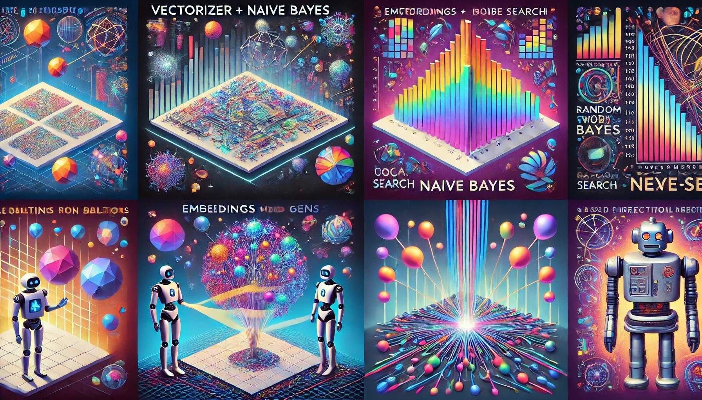

<!-- PROJECT LOGO -->
 

  

<h3 align="center">Procesamiento de Lenguaje Natural</h3>

  

    Especializacion en Inteligencia Artificial
  

<!-- ABOUT THE PROJECT -->

## About

 

  

(<a href="#readme-top">back to top</a>)

El proyecto consiste en cuatro desafios realizados para el curso de procesamiento de lenguaje natural en el contexto de la carrera de especializacion en inteligencia artificial de la Universidad de Buenos Aires.

<!-- USAGE EXAMPLES -->

## Challenges

<strong>Vectorizador + Naive bayes:</strong>

<em>

El primero de los desafios consiste en vectorizar documentos con efoque clasico utilizando TF-IDF. Estos documentos pertencen a diferentes clases, por lo que posteriormente se analiza la similaridad coseno basada en la vectorizacion. Luego se entrena un modelo Naive-Bayes en sus versiones complemento y multinomial. Se analizan los resultados para ambos modelos probando diferentes configuraciones de preprocesamiento del texto. Finalmente, trasponiendo la matriz documento-termino, se analiza la similaridad coseno entre terminos.

</em>

- ✅ [link al notebook][desafio1-notebook-url]

<strong>Embeddings con Gensim:</strong>

<em>

El segundo de los desafios consiste en el entrenamiento de embeddings utilizando la libreria Gensim. Como corpus se utilizan canciones un compositor argentino de folclore, descargadas mediante web scraping. Finalmente se analiza la similaridad positiva o negativa entre diferentes terminos. Finalmente se proyectan los embeddings generados a espacios de menores dimensiones utilizando PCA y T-SNE.

</em>

- ✅ [link al notebook][desafio2-notebook-url]

<strong>Modelo del lenguaje:</strong>

<em>

El tercer desafío introduce los modelos del lenguaje de aprendizaje profundo. Como corpus se utilizan nuevamente las canciones de folclore, pero en este caso se incorporan las letras de numerosos compositores del genero. Se preprocesan las canciones para generar los set de entrenamiento y validacion. Utilizando capas de tipo LSTM se entrena un modelo secuencial de lenguaje basado en prediccion de la proxima palabra incorporando un early stopping basada en la metrica de perplejidad aplicada sobre el set de validacion. Finalmente se utiliza beam search y muestreo aleatorio para la generacion de nuevas canciones a partir de una serie de terminos iniciales.

</em>

- ✅ [link al notebook][desafio3-notebook-url]

<strong>BOT QA:</strong>

<em>

El cuarto desafio consiste en la creacion de un bot LSTM para preguntas y respuestas. Se utilizan los daots del challenge ConvAI2 y una arquitectura de encoder decoder para el desarrollo de un modelo seq2seq. Posterior al preprocesamiento de los datos se entrenan una serie de modelos con variaciones en la arquitectura incluyendo capas bidireccionales. Para evitar el overfitting se utiliza dropout en las capas LSTM y early stopper basado en cross-validation sobre el set de entrenamiento. Finalemnte se evalua la performance de los diferentes modelos con una serie de preguntas estandarizadas.

</em>

- ✅ [link al notebook][desafio4-notebook-url]

(<a href="#readme-top">back to top</a>)

<!-- LICENSE -->

## License

Distributed under the MIT License. See `LICENSE.txt` for more information.

(<a href="#readme-top">back to top</a>)

<!-- MARKDOWN LINKS & IMAGES -->
<!-- https://www.markdownguide.org/basic-syntax/#reference-style-links -->

[desafio1-notebook-url]: TPs/TP1/challenge_1.ipynb
[desafio2-notebook-url]: TPs/TP2/src/challenge_2.ipynb
[desafio3-notebook-url]: TPs/TP3/src/challenge_3.ipynb
[desafio4-notebook-url]: TPs/TP4/src/challenge_4.ipynb
